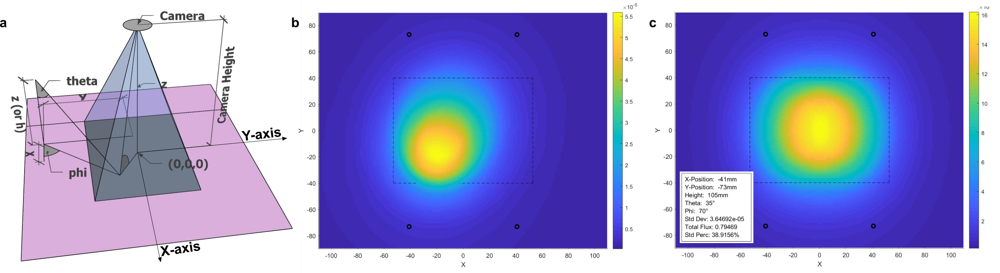
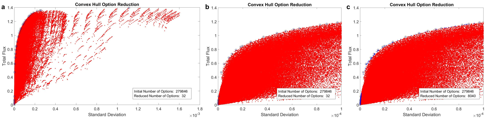

# Summary
The position of light sources within an imaging system has significant consequences for the downstream usability of the data it generates. Non-uniform illumination can contribute to low quality (or in some cases unusable) images, particularly so when illumination variation approaches or exceeds the sensitivity range of the capture device/camera. Similarly, low flux efficiency (i.e. flux through imaging plane divided by total flux from source) will negatively affect the image acquisition and subsequent analysis. Often flux efficiency is sacrificed for illumination uniformity i.e. choosing to deliver less light to the target such that the variation of light intensity across the target remains low. The large number of possible positional configurations of a light source within an imaging system precludes manual optimisation. 

To tackle this issue, we offer a software for modelling the illumination profile for a given light source. The code can be easily adjusted to model a variety of positional configuration and can rapidly calculate the results for many thousands of variable combinations.

Furthermore, we demonstrate an approach by which a user can reduce the amount of possible multi-variable combinations down to the most viable options. This is performed using a modified convex hull approach in two-dimensions (optimising for two figures of merit, i.e. the total flux and the illumination variation). In principle, this method can be extended to n-dimensional space to include additional figures of merit for optimisation.

Our model describes positions of a light source in Cartesian coordinates (x, y and z) relative to the centre of the illuminated area. The spatial region available for light source placement must be defined by the user. In addition, the user defines a range of allowed angles of illumination in Polar coordinates (theta and phi) relative to the surface normal (see Figure 1a).
Based on these user inputs, the software creates a set of illumination configurations, which are then tested for feasibility as defined by the user e.g. to filter-out configurations that would result in the light source being positioned in the target-to-camera light path. This pre-filtering process can also be augmented by the user to suit the needs of their particular system.
The illumination profile as observed by the camera is calculated for each of the positional configurations defined above.  In order to perform this calculation, the model requires the user to specify a far field profile for their specific light source (we provide the characteristics of a 5 mm diameter hemispherical LED in our example code). Our code accounts for the drop in relative intensity due to distance from the light source and angle from the principal axis of the light source. It then utilises a cosine flux correction to identify the projected area difference between the light path and surface normal. Following this, Lambert’s cosine emission law (and a secondary target-to-lens distance factor) is applied in order to determine the radiant intensity as observed by the imaging objective. The code exploits positional symmetry so that illumination from multiple light sources can be computed efficiently.

**Figure 1:**  Light source position and illumination profile. **a)** Schematic illustrating the placement of the light source relative to the illuminated area with all relevant variables. **b)** Illumination profile for a single light source denoted by the circle on the bottom left of the plot. **c)** Illumination profile for a system with four active light sources denoted by the black circles on the plot.  The details of the variable values for these light sources are summarized in a legend on the bottom left of the plot. 

Solving these equations across a matrix of points representing the imaging plane allows one to predict the general illumination pattern and calculate numerical metrics that can be used to optimise the system i.e. total radiant flux (efficiency of light delivered to the target area) and the standard deviation of the flux as a percentage of the mean flux (illumination uniformity). A user can filter the positional configurations dataset using these defined metrics or their own in order to select an optimised illumination configuration for their system. 

We provide a method for filtering these configurations to select settings with the lowest standard deviation for a given total radiant flux.  This method uses a convex hull to determine the set of points required to enclose all other points in the dataset.  As this operation seeks to fully enclose the dataset, a subset of these points will represent regions of low radiant flux which are then removed.  The remaining points represent the best trade-off between total radiant flux and standard deviation (i.e. for a given flux what is the lowest standard deviation possible from the positional configurations dataset).  As standard deviation is not necessarily a perfect descriptor for uniformity, additional data points may be of interest.  Therefore, the user can provide tolerance values for both total radiant flux and standard deviation to broaden the domain of selected configurations.  This process is detailed in Figure 2.  

**Figure 2:**  Demonstration of convex hull based data filtering.  **a)** The figures of merit, total flux  and illumination variation (standard deviation), define the axes against which every parameter-combination is mapped (forming a cloud). The modified convex hull (boundary) of the candidate population is shown in blue.  **b)** A total flux tolerance of 0.05 and a standard deviation tolerance of 10-6 was applied and the selected data points are shown in blue. 
  
Finally, our supplied plotting function enables the user to visually check the illumination profile and the relative positions of the light sources to ensure the results are acceptable (see Figure 1b&c).
In summary, this software can screen large numbers of possible variable values for the positioning of the light sources for total flux and uniformity. This will allow a user to design an optimised light array for their imaging system without requiring numerous, time-consuming experimental measurements.

# Acknowledgements

N.M.F. acknowledges the EPSRC for support under a Doctoral Training Partnership (EP/M507970/1).

