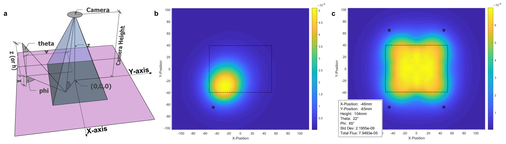

# Summary

When designing imaging systems, success depends on the positioning of the light source.  Non-uniform illumination will provide low quality images and significant information may be lost.  Similarly, low levels of flux across the illuminated area will negatively affect the image acquisition and subsequent analysis.  Often uniformity is achieved at the cost of the flux over the illuminated area and a compromise must be made.  A major limitation to collecting the data on uniformity and flux is the large number of factors to consider when positioning a light source.  Experimentally obtaining the data would be unfeasible due to the time requirements.  To tackle this issue, we offer a software for modelling the illumination profile for a given light source.  The code can be easily adjusted to model a variety of set-ups and can rapidly calculate the results for thousands of variable combinations.  
The range of values for both the x, y, and z positions of the light source relative to the illuminated area as well as the range of allowed angles of illumination (as defined by theta and phi) can be adjusted to be the requirements of the imaging system (see Figure 1a).  Based on these ranges, the software creates all possible combinations of values of each variable.  These are then tested for feasibility which eliminates any combinations that are not allowed by the system.  This process can also be augmented by the user to suit their systems particular needs.  The model in the system then develops an illumination profile for each combination.  It takes into account the drop in relative intensity due to distance from the light source and angle from the central beam of the light source.  A sample dataset containing a far field profile is included in the software; however, the user should provide the data specific to the light source.  It then uses the cosine emission law to account for the angle between the light source and the illuminated area.  Finally, the cosine emission law is used again to determine the light reaching the imaging device.  The results provide the total flux across the illuminated area, the standard deviation of that flux, and the standard deviation of the flux as a percentage of the mean flux.  This is the data required to determine an optimal combination of variables to achieve the required balance between illumination intensity and uniformity.  Lastly, a plotting function enables the user to visually check the illumination profile and the relative positions of the light sources to ensure the results are acceptable (see Figure 1b&c).    
 In summary, this software can screen large numbers of possible variable values for the positioning of the light sources for total flux and uniformity.  This will allow a user to design an optimised light array for their imaging system without requiring numerous, time-consuming experimental measurements.  

# Acknowledgements

N.M.F. acknowledges the EPSRC for support under a Doctoral Training Partnership (EP/M507970/1).
